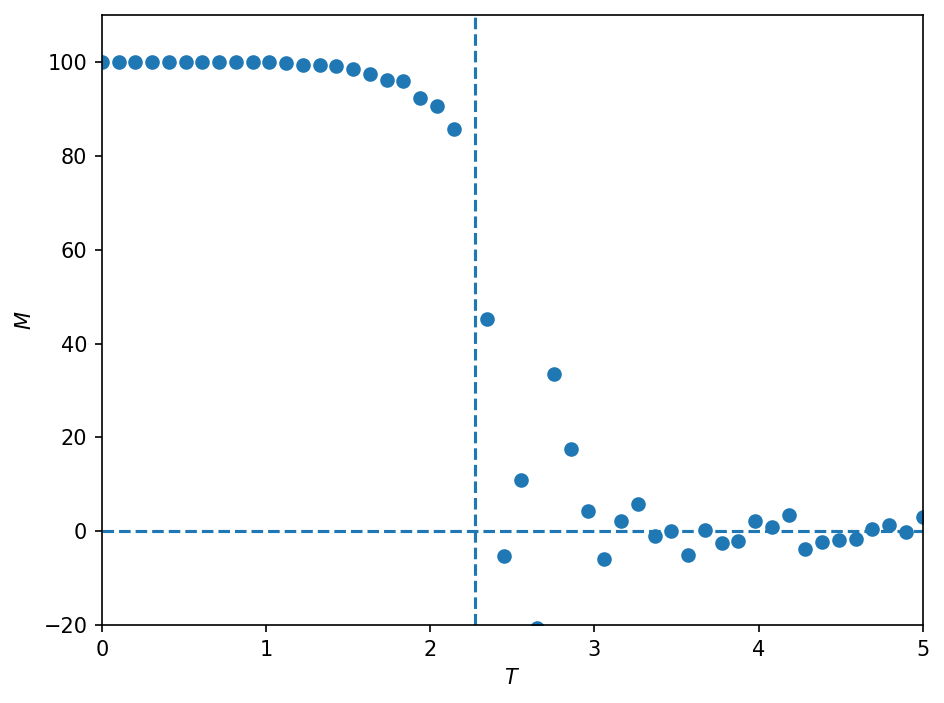

# Monte Carlo method

The code is available in [montecarlo.py](../montecarlo.py).

## Theory

## Results

The output of a case with the following configuration are available below.

- $N_i = 10$, $N_j = 10$
- $J = -1$
- $\epsilon = 0$

## References

- Giordano, Nicholas J., and Hisao Nakanishi. Computational Physics. 2nd ed. Upper Saddle River, NJ: Pearson/Prentice Hall, 2006.
